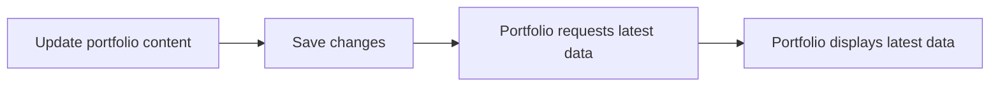

---
title: Introduction
description: Learn what Nukleio does and how to use it to manage your portfolio content.
---

# Introduction

Nukleio helps you manage the content behind your portfolio website from one place. Instead of editing code every time you want to update your bio, projects, links, resume, or images, you can make those changes in the Nukleio dashboard and let your connected portfolio site fetch the latest version.

Think of Nukleio as the control center for your developer portfolio. Your portfolio website still controls how everything looks, but Nukleio controls the information it displays.

## What You Can Do With Nukleio

Use Nukleio to keep your portfolio content organized, current, and reusable across connected sites.

You can manage:

- your profile information, including name, bio, location, role, and company
- social and professional links such as GitHub, LinkedIn, Instagram, Facebook, and X
- portfolio projects with descriptions, dates, GitHub links, demo links, languages, frameworks, technologies, and thumbnail images
- portfolio files such as your resume, transcript, portrait, and project images
- API keys used by your portfolio website to securely request your public portfolio data

When you update content in Nukleio, your connected portfolio displays the updated information instantly without requiring you to manually edit and redeploy your site.

## Why Use Nukleio?

Nowadays, software developers are constantly gaining new skills, building new projects, and learning new things. Keeping your portfolio website up to date with your latest information can become a tedious chore.

A portfolio is easier to maintain when content and design are separate.

Without Nukleio, updating a portfolio often means opening the codebase, finding the right component or data file, changing text or image paths, rebuilding the site, and redeploying. Not to mention, if it's been awhile since you last looked at your site, you may need to relearn how you implemented it. If your initial implementation was not scalable, a simple data update can turn into a multi-day chore. That works, but it becomes repetitive as your projects, roles, links, and documents change over time.

With Nukleio, you update your portfolio data through a dashboard. Your website then retrieves that data from Nukleio's public API and renders it in your own design.

This is useful if you:

- want a portfolio that is easier to update over time
- have multiple portfolio versions or experiments that should share the same data
- want to keep project details, files, and links in one organized place
- prefer changing portfolio content from a web dashboard instead of source code
- want your portfolio frontend to focus on presentation instead of data management
- want to view metrics on your portfolio's traffic easily

## How Nukleio Works

Nukleio has two main parts: the dashboard and the public API.

### Dashboard

The dashboard is where you sign in and manage your portfolio content. This is the primary place you will add, edit, upload, and organize information.

Common dashboard tasks include:

- updating your basic profile details
- adding or editing projects
- uploading a portrait, resume, transcript, or project thumbnail
- entering links for GitHub, LinkedIn, demos, and social profiles
- choosing the languages, frameworks, and technologies used in each project
- creating and managing API keys for connected portfolio sites
- utilizing generative AI tools for optimized custom cover letter, resume, and professional headshot generation

### Public API

The public API lets your portfolio website request your Nukleio data. A connected portfolio sends an API request using your API key, and Nukleio returns your public portfolio information as JSON.

Your portfolio can then use that response to render sections such as:

- hero profile content
- about or bio sections
- project galleries
- technology lists
- resume or transcript links
- contact and social links

You do not need to expose your database or manually copy data into your portfolio project. Nukleio acts as the source of truth, and your portfolio consumes the approved public data.

## Typical Workflow

In practice, this means you can make a portfolio update once in Nukleio and have the connected site use the latest data instantly.

## Who Nukleio Is For

Nukleio is built for developers who want a cleaner way to maintain portfolio content.

It is especially helpful for:

- students building a first technical portfolio
- job seekers who update projects, resumes, and links often
- developers who maintain more than one portfolio site
- designers or frontend developers who want portfolio data separate from the UI
- anyone who wants a reusable portfolio backend without building one from scratch

## What This Documentation Covers

These docs are for Nukleio users and customers. They explain how to use the product, manage your content, and connect a portfolio website to your Nukleio account.

Recommended reading order:

1. Getting Started
2. Account and Dashboard Overview
3. Managing Profile Information
4. Managing Projects
5. Uploading Files and Images
6. Creating API Keys
7. Connecting a Portfolio Website
8. Public API Reference
9. Troubleshooting

## Key Terms

| Term           | Meaning                                                                             |
| -------------- | ----------------------------------------------------------------------------------- |
| Dashboard      | The Nukleio web app where you manage portfolio content.                             |
| Portfolio site | The website that displays your portfolio to visitors.                               |
| Public API     | The Nukleio API your portfolio uses to request public portfolio data.               |
| API key        | A key that allows a portfolio site to request your approved Nukleio data.           |
| Project        | A portfolio item with details such as description, links, technologies, and images. |
| Asset          | A file managed in Nukleio, such as a resume, transcript, portrait, or thumbnail.    |

## Next Step

Continue to Getting Started to create your account, complete your profile, and prepare your first portfolio integration.
